# The Battle of Jakku

The Battle of Jaku is an engaging online game inspired by the renowned Star Wars franchise. In this game, the user is presented with three exciting options, allowing them to make strategic decisions that shape their gameplay experience. 

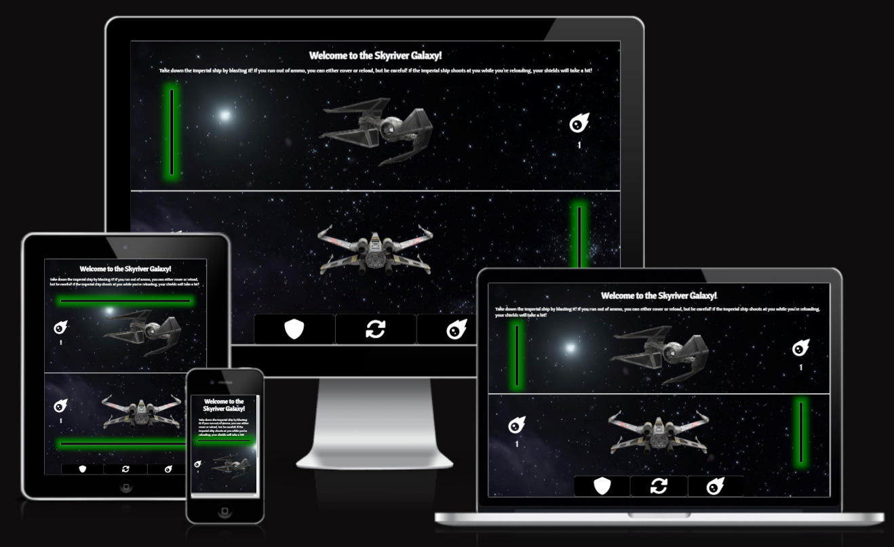

The Battle of Jakku website is live, to access it [click here.](https://juanovt10.github.io/battleOfJakku_chanceGame/)

## Table of Contents
+ [UX](#ux)
+ [Design](#design)
+ [Features](#features)
+ [Testing](#testing)
+ [Technologies Used](technologies_used)
+ [Deployment](#deployment)
+ [Credits](#credits)

## UX

### Site purpose

The purpose of the site is to provide an interactive game where users engage by pressing buttons, receiving visual feedback for every action taken by the bot and the user.

### Site goal

Entertain users by presenting them with three distinct options and challenging them to strategize and determine the most effective choice to outsmart the bot.

### Audience

The website is designed for Star Wars fans who seek an interactive gaming experience.

### Current User Goals

Experience interactive engagement on the website and receive unique feedback based on the decisions made by either the user or the bot.

### Future User Goals

- Engage with the website
- Have visual feedback of each action taken, such as blinking colors, appearing popups and hovering effects. 

## Design 

### Color Scheme 

The website employs a streamlined monochromatic color scheme of black and white for the popups and titles, harmonizing with the deep space background. 

In terms of the "health bars," a visually intuitive traffic light color scheme is implemented: displaying vibrant green for optimal life levels, transitioning to yellow to indicate a moderate state, and intensifying to a striking red when life is nearing depletion. Furthermore, the blue color is applied to reflect the protective feedback of the cover action. 

The information popups feature a white shadow, while the winning and losing popups showcase a blue and red shadow respectively. These shadow colors represent the iconic and contrasting hues of the Star Wars Franchise, adding a touch of excitement and visual impact to the overall design.

### Typography

The Cantora One font is applied to all elements within the body, as it closely resembles the trademarked Star Wars font available in Google Fonts. 

### Imagery

The captivating deep space background image was acquired from [Freepik](https://www.freepik.com/) website, providing an immersive and atmospheric setting for the game. Additionally, the "avatars" for both the bot and user were obtained from [pngegg](https://www.pngegg.com/) website as vectors, enabling the space ships to seamlessly integrate with the cosmic surroundings, resulting in a harmonious visual composition.

The button and ammunition icons were sourced from [Font Awesome](https://fontawesome.com/), ensuring a visually appealing interface.

## Features

### Existing Features

#### Initial popup 

Upon loading the website, an initial popup promptly appears on the screen, providing an immediate point of interaction and engagement for the user:

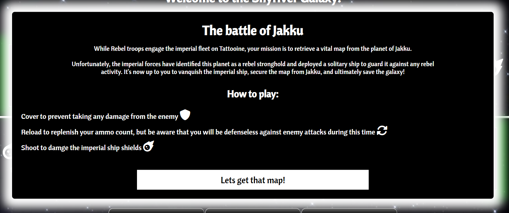

The popup features an engaging storyline to intrigue the user, along with concise instructions on how to play. By simply clicking the button, the user is transported to the gaming platform, ready to begin their playthrough. 

#### Home page

The game interface features a header title and a concise paragraph restating the game's purpose. Below that, you'll find the game area displaying the health bar, avatar, and ammunition count for both the bot and the user. These components provide a clear overview of the essential elements in the game. 

Following that, the user controls are presented as three distinct buttons, allowing players to interact and exert control over their gameplay experience.

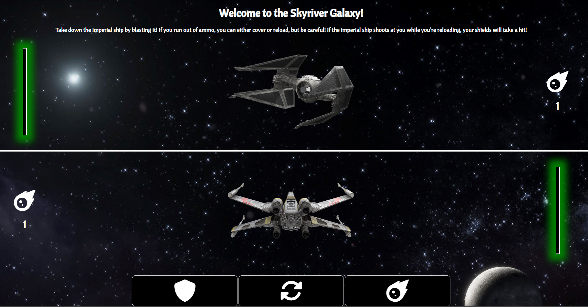

#### Gameplay

The game's main goal is to shoot the enemy while they are reloading. The user has three options: cover, reload, and shoot. Cover and reload can be chosen at any time, but shooting requires available ammunition. Each shot reduces the ammunition count, which gradually increases as the player reloads. Simultaneously, the bot will choose the same set of options. If it has ammunition available, it will randomly select one of the three options. However, if it doesn't have ammunition, it will randomly choose between cover or reload as its course of action.

#### Feedback queues 

To enrich the static game experience, visual feedback is employed to provide users with immediate responses to their decisions. 

- When selecting cover, the button hovers in blue, and the health bars blink between black and blue. 

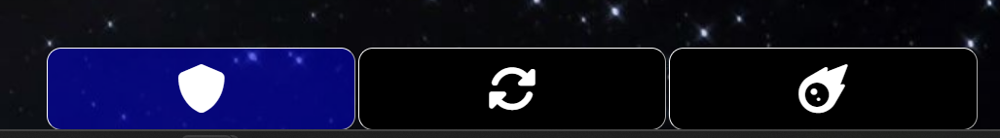

- Reloading triggers a green hover effect on the button and a blinking green ammunition count, indicating the increase in ammunition. 

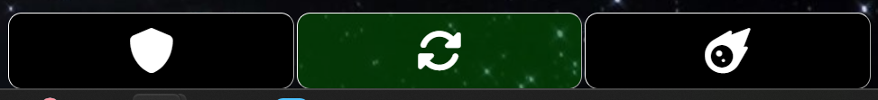

- The shoot button hovers in red when ammunition is available. When ammunition is depleted, the shoot button turns grey and the hover effect is disabled. Clicking the grey button triggers an information popup explaining that shooting is not possible at the moment and the amminution count will turn red.

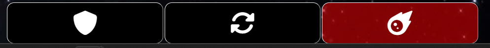
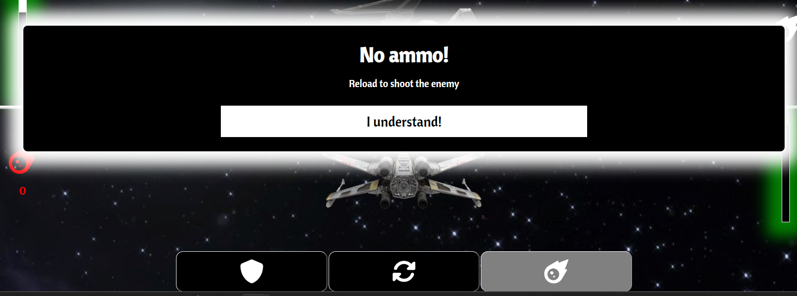

- When either the bot or the user gets hit (e.g., the user shoots while the bot is reloading, or vice versa), the border of the health bar for the affected player flashes in red. Additionally, the health bar is reduced by 20% to reflect the impact. If the player's health falls below 70%, the shadow of the health bar changes to yellow, indicating a diminished health status. Furthermore, if the player's health drops below 30%, the shadow shifts to red, symbolizing a critical condition where life is nearing its end.

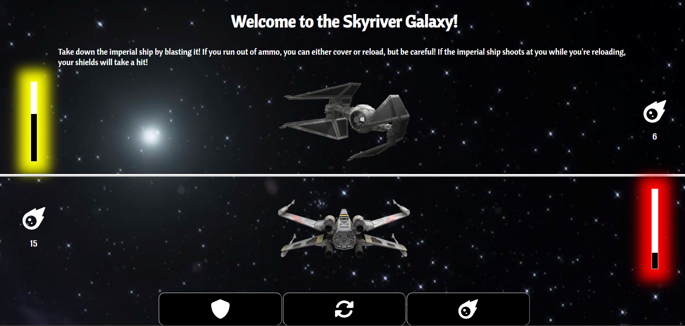

- When the user emerges victorious, a popup with a blue shadow appears, congratulating them with a brief story conclusion and an option to play again. In the event of the bot's victory, a different popup with a red shadow appears, indicating the user's defeat and providing the option to play again.

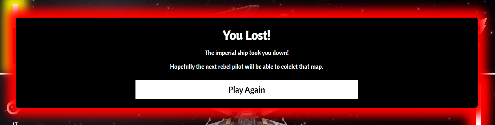
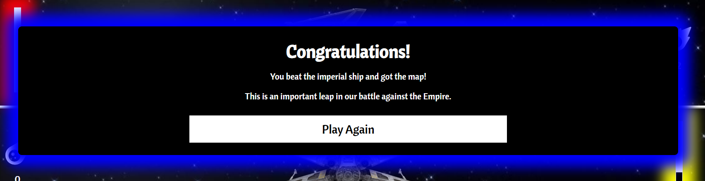

## Testing

The CSS and JavaScript aspects presented significant challenges in this project. One notable issue was implementing the blinking effect for the health bars and ammunition count, synchronizing them with the actions of both the user and the bot. Extensive research was conducted to find a viable solution, resulting in the following approach:

```
let ammoElement = document.getElementById(ammoId);

    ammoElement.style.color = 'green';

    function toggleColor() {
        if (ammoElement.style.color === 'green') {
        ammoElement.style.color = 'white';
        } else {
        ammoElement.style.color = 'green';
        }
    }

    let interval = setInterval(toggleColor, 200);

    setTimeout(function () {
        clearInterval(interval);
        ammoElement.style.color = 'white';
    }, 400);
```

To implement the aforementioned solution, I utilized the getElementById method to select the desired element for the blinking effect. Subsequently, I assigned the blink color and defined a function responsible for checking the current color state of the element and toggling it to its opposite. I then established an interval variable to repeatedly call the toggle function at intervals of 200ms. Finally, using the setTimeout method, I cleared the previously defined interval after double the time duration, allowing the complete sequence to span 400ms.

This similar code was applied to the following functions: 
- ammoBlink()
- cover()
- userDamage()

Another challenge in the JS script involved adjusting the health bars to decrease from left to right when the screens are 768px wide or smaller. To accomplish this, I utilized the window.innerWidth property to obtain the width of the screen and incorporated it into several functions to determine whether the affected value of the health bar should be the width or the height. This dynamic approach allowed for responsive adjustments to the health bar direction based on the screen width, ensuring a consistent and optimal user experience.

```
if (window.innerWidth > 768) {
        document.getElementById('user_health_bar').style.height = currentUserHealth;
        document.getElementById('cpu_health_bar').style.height = currentCpuHealth;
    } else {
        document.getElementById('user_health_bar').style.width = currentUserHealth;
        document.getElementById('cpu_health_bar').style.width = currentCpuHealth;
    }
```

The if statement for the health bars was used in the following functions: 
- Initial function of the DOMContentLoaded event listener
- checkHealth()
- checkAnswer()
- restartGame()

The final challenge involved ensuring that all elements fit within a single page on various screen sizes. To achieve this, I set the height of the body element as 100vh, allowing it to occupy the full viewport. I then implemented appropriate media queries to accommodate different screen sizes. However, it is important to note that for smaller mobile phones, scrolling may be necessary to visualize the entire game interface due to space constraints. By adapting the layout to different screen sizes, the goal was to optimize the user experience while providing a seamless gameplay environment.

### Validator testing
- The html file passed through the [W3C validator](https://validator.w3.org/) with no issues. 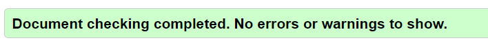
- The CSS file passed through the [Jigsaw validator](https://jigsaw.w3.org/css-validator/) with no issues. 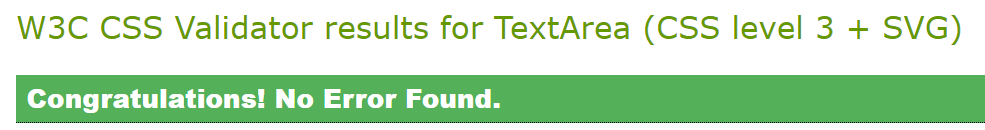
- The JS script passsed through the [jshint validator](https://jshint.com/) by only displaying the let vs var at the moment of declaring variables. 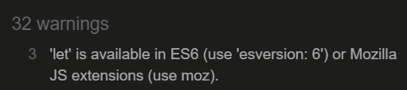
- The page has an excellent Accessibility rating in Lighthouse 
- Tested the site in Chrome, Safari and Edge

### Unfixed bugs 

The primary challenge encountered in this project revolved around ensuring the responsiveness of the elements across various screen sizes. The issue primarily manifested when screens had limited height rather than width. To address this, I incorporated the 100vh property for the body to make the content fit within the viewport. However, for smaller screens, I set the height of elements with the .game_area class to auto to prevent avatar overlap. Despite these adjustments, it is important to note that on smaller screens, users may need to scroll down to access the buttons and engage in gameplay.

## Technologies used

### Programming languages used

- HTML5
- CSS
- JavaScript

### Frameworks, Libraries & programs used
- Google fonts - for the font families: Cantora One. San-serif was used as a default font.
- Font Awesome - to add icons for control buttons and the ammunition count
- CodeAnywhere - to creat my html files, styling sheet and js script before pushing the project to Github.
- GitHub - to store my repository for submission.
- Am I Responsive? - to ensure the project looked good across all devices.

### Deployment 
The site was deployed to GitHub pages. The steps to deploy are as follows:

- In the GitHub repository, navigate to the Settings tab
- On the left hand side menu, navigate to the pages tab user code and automation.
- In build and deplyment, under branch, select the main Branch
- Once the main branch has been selected, the page will be automatically refreshed with a detailed ribbon display to indicate the successful deployment.
- The live link can be found [here - The Battle of Jakku](https://juanovt10.github.io/battleOfJakku_chanceGame/).

## Credits 

### Design 

The main theme of the game draws inspiration from the iconic [Star Wars franchise](https://www.starwars.com/), incorporating various elements that pay homage to its aesthetic. One such element is the utilization of fading box shadows, resembling the lightsabers synonymous with the Star Wars universe. This design inspiration was derived from [GreatStack](https://www.youtube.com/watch?v=Odr24UQs3uY) and [CodeLab](https://www.youtube.com/watch?v=F7iFnhSZe7o) tutorials, which served as a creative influence in implementing these captivating visual effects.

### Code

Regarding the code, the main problem that I encountered was to make elements blink when an action was taken. To do this I explore various solutions and JS methods from the following websites: 

- [freeCodeCamp](https://www.freecodecamp.org/news/javascript-settimeout-how-to-set-a-timer-in-javascript-or-sleep-for-n-seconds/#:~:text=To%20cancel%20a%20setTimeout(),call%20the%20setTimeout()%20method.)
- [Developer Mozilla](https://developer.mozilla.org/en-US/docs/Web/API/clearTimeout)
- [W3Schools](https://www.w3schools.com/jsref/met_win_cleartimeout.asp)

### Media

The background image was taken from [freepik](https://www.freepik.com/free-photo/galaxy-night-landscape_13140050.htm#query=space%20stars&position=36&from_view=keyword&track=ais)

The avatar pngs were taken from [pngegg - X-wing](https://www.pngegg.com/en/png-nkfii/download) and [pngegg - Imperial fighter](https://www.pngegg.com/en/png-tfxws/download)